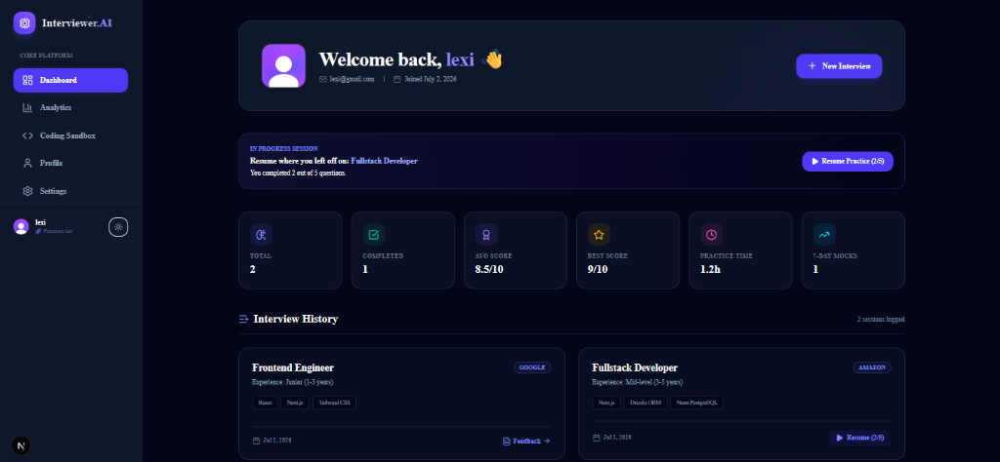
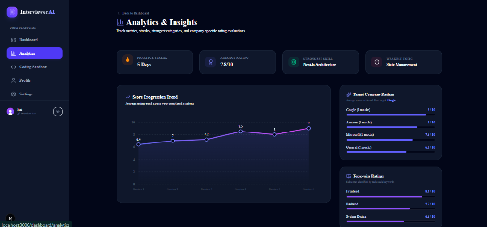
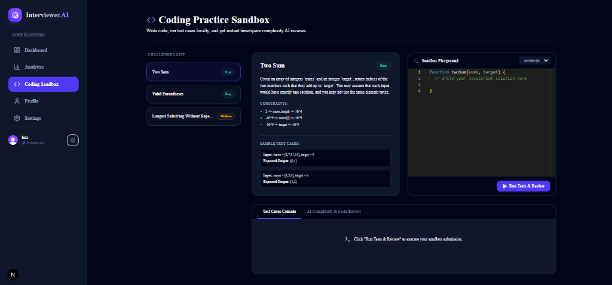
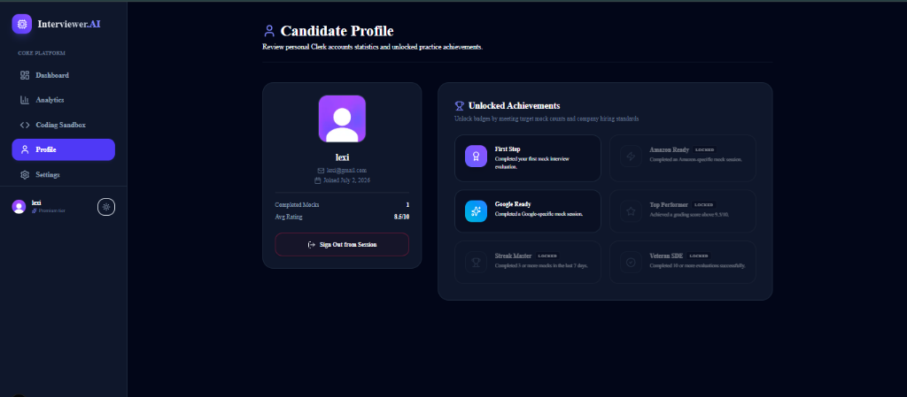
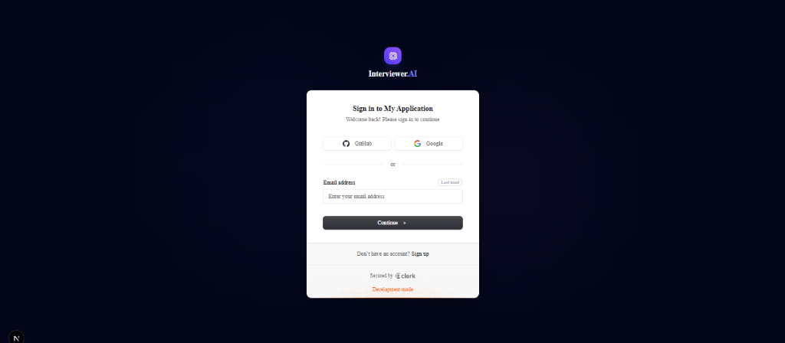
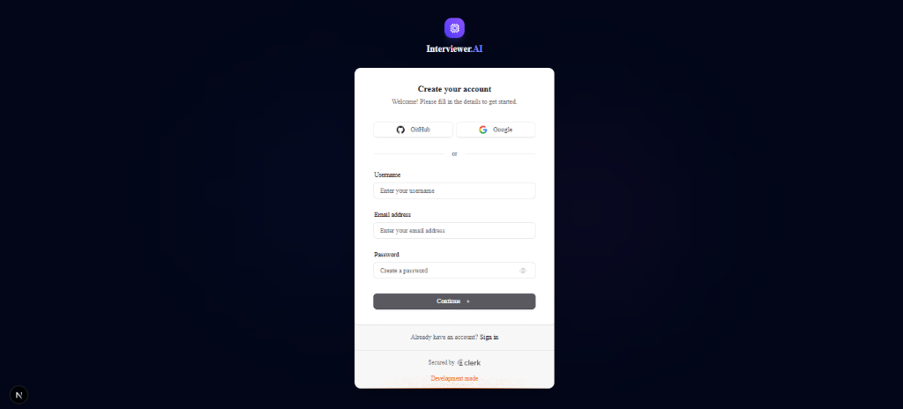

# Interviewer.AI — Next-Gen AI Mock Interview & Coding Practice Platform

Interviewer.AI is a premium, production-ready SaaS platform that helps software engineers prepare for technical interviews at top-tier product companies. By leveraging Google Gemini AI, Web Speech APIs, and the Monaco Editor, candidates can simulate realistic behavioral, technical, and coding interview rounds.



---

## 📸 Feature Tour

### 1. Analytics & Insights Dashboard
Track your performance progression trend line, company-specific rating averages, weaknesses, strengths, and weekly streaks.


### 2. Monaco Coding Practice Sandbox
Write code directly in JavaScript, Python, Java, or C++, run test cases locally, and get instant time/space complexity AI audits.


### 3. Gamified Achievements Profile
Review your account summary, completed mocks counts, average scores, and unlock badges like "Google Ready" or "Amazon Ready".


### 4. Seamless Onboarding & Authentication
Safe and beautiful login and sign-up portals with custom-synchronized password visibility toggles.
<table>
  <tr>
    <td width="50%"><strong>Sign In Portal</strong><br/></td>
    <td width="50%"><strong>Sign Up Portal</strong><br/></td>
  </tr>
</table>

---

## 🌟 Key Features

### 1. Dynamic AI Mock Interviews
*   **Interviewer Follow-ups**: In-simulation conversational logic where Gemini dynamically asks 1-sentence follow-up questions based on candidate answers to probe technical depth.
*   **Dictation & Speech-to-Text**: Integration with standard Web Speech APIs (`SpeechRecognition`) for hands-free response recordings.
*   **Timers & Controllers**: Individual count-up question timers, overall session count-down timers, and pause/resume triggers.

### 2. Multi-Language Coding Sandbox
*   **Monaco Editor Sandbox**: Sibling playground supporting JavaScript, Python, Java, and C++.
*   **AI Complexity Reviewer**: Gemini performs structural code compilations, parses edge cases, and provides instant $O(N)$ Time & Space complexity audits.

### 3. Smart Resume Parsing & Customizer
*   **Resume Parser**: Extracts structured details (Skills, Projects, Education, Experience) from resume context to save directly in the database (`resumeAnalysis`).
*   **Copy-Paste Customizer**: Form-level textarea enabling candidates to paste resume contexts or review/edit parsed text directly.

### 4. Interactive Analytics & Badges
*   **Progress Charts**: SVG charts tracing rating progression lines, category averages, and company ratios.
*   **Streak Metrics & Streaks**: Weekly mock practice trackers with weakest topic notifications.
*   **Gamified Badges**: Unlocked achievements based on completed sessions (e.g. "First Step", "Google Ready", "Amazon Ready").

### 5. Multi-factor Feedback & Exports
*   **Detailed Scores**: Breakdown metrics for Technical depth, Communication, Grammar, Confidence, Problem Solving, and Professionalism.
*   **PDF Exporter**: Clean media print layout to download and save feedback reports.

---

## 💻 Tech Stack

*   **Framework**: Next.js 16 (App Router)
*   **UI Library**: React 19, Tailwind CSS, Radix UI, lucide-react
*   **Database & ORM**: Neon PostgreSQL, Drizzle ORM
*   **Authentication**: Clerk Authentication
*   **AI Models**: Google Gemini AI (`gemini-1.5-flash`)
*   **Code Sandbox**: Monaco Editor (`@monaco-editor/react`)

---

## ⚙️ Environment Setup

To run this application locally, create a `.env.local` file in the root directory and add the following keys:

```env
# Database Credentials
DATABASE_URL=your_neon_postgresql_connection_string

# Google Gemini API
GEMINI_API_KEY=your_gemini_api_key

# Clerk Authentication
NEXT_PUBLIC_CLERK_PUBLISHABLE_KEY=your_clerk_publishable_key
CLERK_SECRET_KEY=your_clerk_secret_key
NEXT_PUBLIC_CLERK_SIGN_IN_URL=/sign-in
NEXT_PUBLIC_CLERK_SIGN_UP_URL=/sign-up
```

*Note: If the `DATABASE_URL` is set to the default placeholder (`neon_host_placeholder`), the application automatically short-circuits to local high-fidelity mock data so you can preview the platform immediately.*

---

## 🚀 Setup Instructions

1.  **Clone the Repository**:
    ```bash
    git clone https://github.com/your-username/ai-mock-interview.git
    cd ai-mock-interview
    ```

2.  **Install Dependencies**:
    ```bash
    npm install
    ```

3.  **Run Migrations**:
    ```bash
    npm run db:push
    ```

4.  **Launch Local Development Server**:
    ```bash
    npm run dev
    ```

5.  **Build for Production**:
    ```bash
    npm run build
    npm run start
    ```
